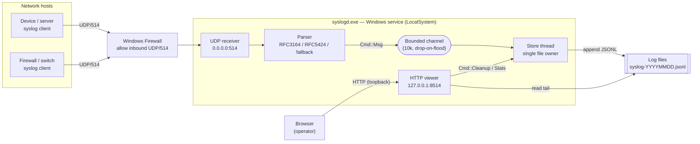
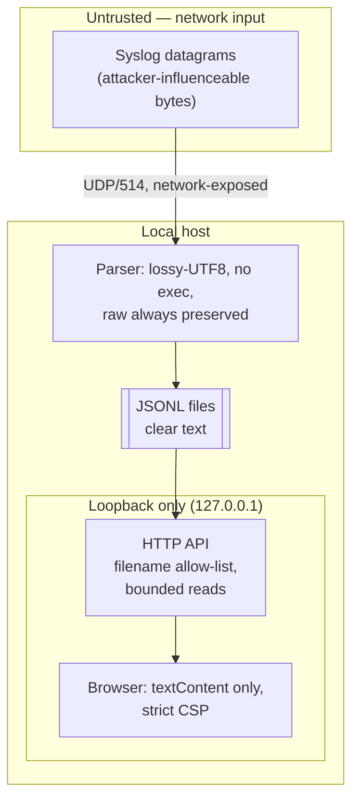

# Syslog Collector — Feature Plan & Design

**One line:** A lean, self-contained Windows syslog server (UDP/514) that parses
messages, persists them as JSON-lines log files, runs as an auto-start service,
and serves a clean loopback web viewer — one native `.exe`, one dependency.

> Status: **implemented**. This document is the design record for the shipped
> code in this repository.

## 1. Context

- **Need:** Collect syslog from many network hosts on a Windows box; view and
  inspect messages; survive reboots. No alerting/paging.
- **Constraints (from the request):**
  - Listen on UDP/514; reachable from the network (firewall opened).
  - Easy to run on Windows with **no runtime install** (no Python/Node/JRE).
  - Handle **many concurrent senders**.
  - Persist across boots; run as a **Windows service** (auto-start).
  - Install into **Program Files** (Win 10/11); **x64** with **x86** fallback.
  - Clean, simple UI to browse messages and open one for detail.
  - Set the **log folder at install**; a file is created **after the first
    message**.
  - "**Garbage collection**" of logs by age and/or size, triggerable from the UI.
  - **Lean but sturdy.** Language: **Rust** (no GC, no memory-pile-up).
- **Assumptions:** Runs in a VM; trusted-ish LAN; single local operator for the
  UI; modest-to-moderate message volume (SOHO / lab / small-fleet scale).

## 2. Architecture



**Message flow (receive → view):**

```mermaid
sequenceDiagram
  participant Dev as Device
  participant UDP as UDP receiver
  participant St as Store thread
  participant FS as Log file
  participant UI as Browser
  participant HTTP as HTTP viewer

  Dev->>UDP: <PRI>... datagram
  UDP->>UDP: parse -> Message
  UDP->>St: Cmd::Msg (try_send)
  St->>FS: create-if-first, append JSON line, flush
  UI->>HTTP: GET /api/messages?file&limit
  HTTP->>FS: read last ~2 MiB tail
  HTTP-->>UI: JSON array (already-serialized lines)
  UI->>UI: render table; click -> detail modal
  UI->>HTTP: POST /api/cleanup
  HTTP->>St: Cmd::Cleanup
  St->>FS: delete aged / oversized files (never the active one)
```

## 3. Component breakdown

- **UDP receiver** (`main.rs::udp_loop`) — one socket bound `0.0.0.0:514`
  receives from all senders (UDP is connectionless; one socket serves the whole
  fleet). 1 s read timeout so it notices service stop. Parses each datagram and
  `try_send`s to the channel; drops on overflow rather than blocking.
- **Parser** (`syslog.rs`) — decodes PRI → facility/severity, then RFC 5424,
  else RFC 3164, else treats the whole payload as the message. `raw` always
  retained. Std-only RFC3339 clock (no `chrono`).
- **Bounded channel** (`std::sync::mpsc::sync_channel`, cap 10 000) — decouples
  receive from disk I/O; back-pressure bound prevents unbounded memory growth.
- **Store thread** (`store.rs`) — the **single owner** of all file handles: no
  write races, and cleanup can never delete the file being written. Creates the
  day file on first message, rotates by size, enforces retention, answers
  stats/cleanup commands, and auto-cleans on a 10-minute idle timer.
- **HTTP viewer** (`http.rs`) — minimal std-only HTTP/1.1 on `127.0.0.1:8514`.
  Serves the embedded UI and a small JSON API. Reads only the file **tail** to
  bound memory regardless of file size.
- **Viewer UI** (`web/index.html`) — one page, system fonts, no external assets.
  Table + severity colors + client-side filter + detail modal + cleanup button.
- **Windows service** (`service.rs`) — SCM integration (install/uninstall/run),
  auto-start, `sc failure` auto-restart, and the `netsh` firewall rule.
- **Config** (`config.rs`) — plain `key=value` at
  `%ProgramData%\SyslogCollector\config.txt`.

## 4. Data & trust boundaries



- **Trust boundary 1 — network → parser.** All datagram bytes are untrusted.
  Parsing is total (never panics on input), lossy-UTF8, no evaluation.
- **Trust boundary 2 — stored log → browser.** Log fields are attacker-
  influenced, so the UI injects them via `textContent`/`createElement` only, under
  a strict `Content-Security-Policy`. The `file` API parameter is validated
  against `^syslog-\d{8}(-\d+)?\.jsonl$` — no path traversal.
- **Exposure surface.** Only UDP/514 is on the network. The UI is loopback-only
  (no auth by design — single local operator).
- **Classification.** Files are clear text; the app makes no PHI/PII/CHD
  guarantees. Point `log_dir` at an encrypted volume for sensitive logs; keep off
  regulated-data hosts unless approved (see `CLAUDE.md`).

## 5. Selected code decisions

Single-owner store loop — one thread, no lock, no delete/write race:

```rust
match rx.recv_timeout(idle) {
    Ok(Cmd::Msg(m))       => store.append(&m),      // create-on-first, rotate
    Ok(Cmd::Cleanup(rep)) => { rep.send(store.cleanup()); }, // never active file
    Ok(Cmd::Stats(rep))   => { rep.send(store.stats()); },
    Err(Timeout)          => { store.cleanup(); },  // periodic auto-GC
    Err(Disconnected)     => break,
}
```

Path-traversal guard (also the file-listing filter):

```rust
pub fn is_log_name(name: &str) -> bool {
    let Some(stem) = name.strip_suffix(".jsonl") else { return false };
    let Some(rest) = stem.strip_prefix("syslog-") else { return false };
    // ... 8 digits + optional "-<digits>" index ...
}
```

## 6. Sequence of work

1. **Parser + JSON + clock** (`syslog.rs`) with unit tests — *done*.
2. **Config** load/save (`config.rs`) — *done*.
3. **Store**: create-on-first, rotate, retention, tail-read (`store.rs`) + tests — *done*.
4. **HTTP** server + API + embedded UI (`http.rs`, `web/index.html`) — *done*.
5. **Wiring**: UDP + store + HTTP threads, clean shutdown (`main.rs`) — *done*.
6. **Windows service** + firewall + install/uninstall (`service.rs`) — *done*.
7. **Installers**: `install.ps1`, Inno `.iss`, `build.ps1` — *done*.
8. **SBOM** (`sbom/app.cdx.json`) + dependency vuln review — *done*.
9. **Verify on Windows**: build x64/x86, install, send from a second host, reboot,
   confirm auto-start and firewall — *pending (needs a Windows host)*.

## 7. Risks & mitigations

| Risk | Impact | Likelihood | Mitigation |
|------|--------|-----------|------------|
| UDP flood / message burst | Memory growth, drops | Med | Bounded 10k channel, `try_send` drops newest under flood; O(1) memory |
| Disk fills from log volume | Service/host degraded | Med | Size rotation + age retention + total-size cap + manual cleanup |
| Malicious content in a log field (XSS) | Operator browser | Low | `textContent`-only rendering + strict CSP |
| DNS-rebinding read of the loopback API | Log-data exposure | Low | `Host`-header validation — only `localhost`/`127.0.0.1[:ui_port]` accepted |
| Crafted UTF-8 datagram | Receiver-thread panic | Low | `is_char_boundary` guard in RFC3164 slice; parser is total |
| Path traversal via `file=` | Arbitrary file read | Low | Strict filename allow-list; bounded tail read |
| Per-write `flush()` slow at high rate | Throughput ceiling | Low | Acceptable for target scale; batch-flush is the noted upgrade path |
| UDP is lossy / unauthenticated | Missed or spoofed logs | Med | Inherent to syslog/UDP; document; TCP/TLS is a future option |
| Can't cross-build MSVC from macOS | No prebuilt binary shipped | High | Source + `build.ps1`; build on the target Windows host |
| Windows-only service API unverifiable here | Build error on Windows | Low | Pinned crate, stable API surface; `sc.exe`/`netsh` for the risky bits |

## 8. Alternatives considered

- **UI: egui/native GUI** — rejected: large dependency tree, bigger binary,
  harder x86 fallback, and Session-0 isolation blocks a service from drawing a
  GUI anyway. A loopback web UI is smaller, decoupled, and framework-free.
- **UI: Tauri** — rejected: WebView2 runtime dependency, heavier, more surface.
- **Storage: SQLite/embedded DB** — rejected (YAGNI): a DB dependency for
  append-and-tail; JSON-lines files are simpler, greppable, and rotate trivially.
- **Service host: Task Scheduler "at startup"** — rejected: the request
  specifically asked for a *service*; it also lacks SCM start/stop semantics.
- **Service wrapper: NSSM/srvany** — rejected: "no extra software," and a real
  service via `windows-service` is cleaner.
- **JSON/syslog crates (serde/serde_json/syslog_loose)** — rejected: hand-rolled
  serialization + parsing keep the dependency count at one and the SBOM trivial.
- **HTTP crate (tiny_http/axum)** — rejected: a GET-only loopback handler is
  ~120 lines of std and adds no dependency.

## 9. Open questions

- Preferred default log path — `C:\SyslogCollector\logs` vs a `D:` data volume?
  (Installer prompts; default is `C:\SyslogCollector\logs`.)
- Expected peak message rate? If sustained bursts exceed disk fsync, switch the
  store to batch-flush (already flagged as the upgrade path).
- Is a lower-privilege service account desired over LocalSystem?

## 10. Out of scope

- Alerting, paging, notifications, dashboards, correlation.
- TCP syslog (RFC 6587) and TLS (RFC 5425); relay/forwarding to another SIEM.
- Authentication on the viewer; remote (non-loopback) UI access.
- Long-term archival, compression, or search indexing across files.
- Non-Windows service packaging (the core is portable; only the service isn't).

---
Updated 2026-09-15: initial plan authored alongside the implementation.
Updated 2026-09-15: ran /code-review (high) + /security-review. Fixed RFC3164 UTF-8 boundary panic, auto-cleanup starvation under continuous load, and a dead `ensure_open` handle-reuse guard; added `Host`-header validation as a DNS-rebinding defense. All in the same commit as this doc.
Copyright (c) 2026 Tristan Conner <tristan@conner.house>. All rights reserved.
